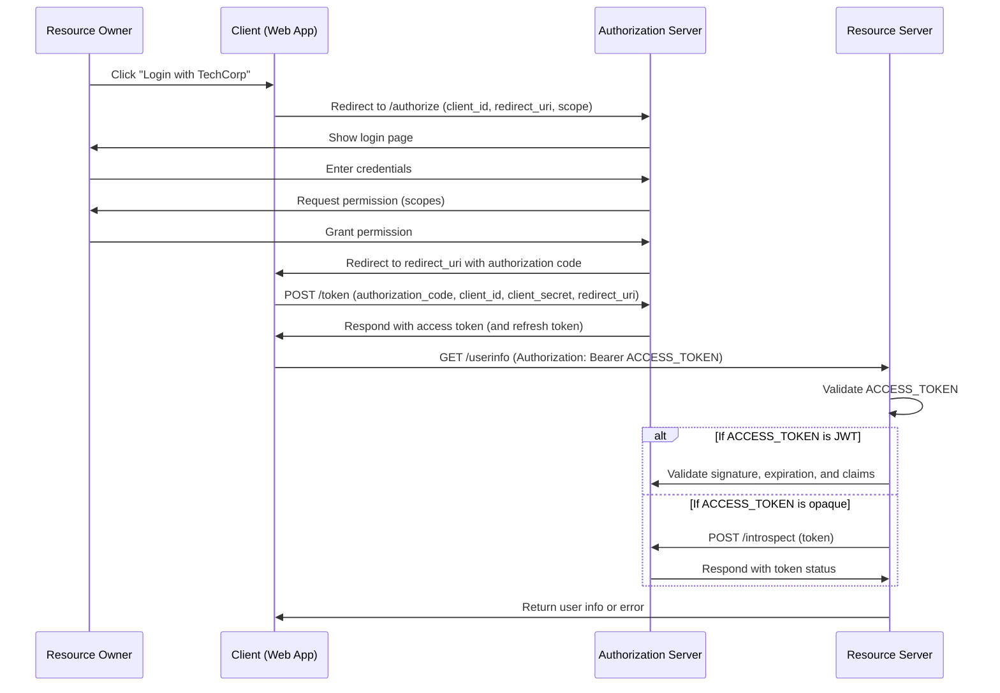

# OAuth 2.0 Process Flow for TechCorp

This document outlines the OAuth 2.0 process flow for TechCorp, which allows users to log in to multiple applications using a single set of credentials. The flow involves interactions between the Resource Owner (user), Client (Web App), Authorization Server, and Resource Server.

## Overview of the OAuth 2.0 Flow

1. **User Initiates Login**: The user clicks "Login with TechCorp" on the Web App.
2. **Authorization Request**: The Web App redirects the user to the authorization server's `/authorize` endpoint.
3. **User Authentication**: The user enters their credentials and grants permission for the requested scopes.
4. **Authorization Code**: The authorization server redirects the user back to the Web App with an authorization code.
5. **Token Exchange**: The Web App exchanges the authorization code for an access token by making a POST request to the `/token` endpoint.
6. **Access Token Issuance**: The authorization server responds with an access token (and optionally a refresh token).
7. **Resource Access**: The Web App uses the access token to request user information from the resource server.
8. **Token Validation**: The resource server validates the access token.
9. **Response**: The resource server returns the user information or an error to the Web App.

## API Endpoints

### 1. Authorization Endpoint

**Endpoint**: `GET /authorize`

**Description**: This endpoint is used to initiate the OAuth 2.0 authorization process. The client (Web App) redirects the user to this endpoint.

**Parameters**:
- `response_type`: Must be set to `code` to indicate that the client expects an authorization code.
- `client_id`: The unique identifier for the client application.
- `redirect_uri`: The URI to which the authorization server will redirect the user after authorization.
- `scope`: A space-separated list of scopes that the client is requesting.
```

**Example Request**:

GET https://auth.techcorp.com/authorize?response_type=code&client_id=web_app&redirect_uri=https://web.techcorp.com/callback&scope=read
```
### 2. Token Endpoint

**Endpoint**: `POST /token`

**Description**: This endpoint is used by the client to exchange the authorization code for an access token.

**Parameters**:
- `grant_type`: Must be set to `authorization_code`.
- `code`: The authorization code received from the authorization endpoint.
- `redirect_uri`: The same redirect URI used in the authorization request.
- `client_id`: The unique identifier for the client application.
- `client_secret`: The client secret associated with the client application.
```
**Example Request**:

POST https://auth.techcorp.com/token
Content-Type: application/x-www-form-urlencoded

grant_type=authorization_code&code=AUTH_CODE&redirect_uri=https://web.techcorp.com/callback&client_id=web_app&client_secret=web_secret
```

**Example Response**:
```json
{
  "access_token": "ACCESS_TOKEN",
  "token_type": "Bearer",
  "expires_in": 3600,
  "refresh_token": "REFRESH_TOKEN"
}
```

### 3. Resource Endpoint

**Endpoint**: `GET /userinfo`

**Description**: This endpoint is used by the client to access user information using the access token.

**Headers**:
- `Authorization`: The access token must be included in the `Authorization` header as a Bearer token.

**Example Request**:
```
GET https://api.techcorp.com/userinfo
Authorization: Bearer ACCESS_TOKEN
```

**Example Response**:
```json
{
  "id": "user_id",
  "name": "John Doe",
  "email": "john.doe@example.com"
}
```

### 4. Introspection Endpoint (for opaque tokens)

**Endpoint**: `POST /introspect`

**Description**: This endpoint is used by the resource server to validate an access token.

**Headers**:
- `Authorization`: Basic authentication with the client ID and client secret.

**Parameters**:
- `token`: The access token to be validated.

**Example Request**:
```
POST https://auth.techcorp.com/introspect
Authorization: Basic Base64(client_id:client_secret)
Content-Type: application/x-www-form-urlencoded

token=ACCESS_TOKEN
```

**Example Response**:
```json
{
  "active": true,
  "client_id": "web_app",
  "exp": 1700000000,
  "scope": "read write",
  "sub": "user_id"
}
```
# diagram for this flow:

